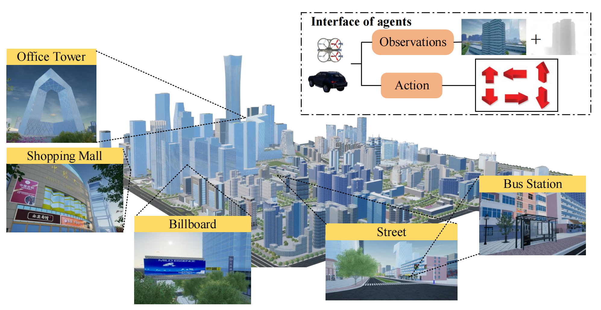
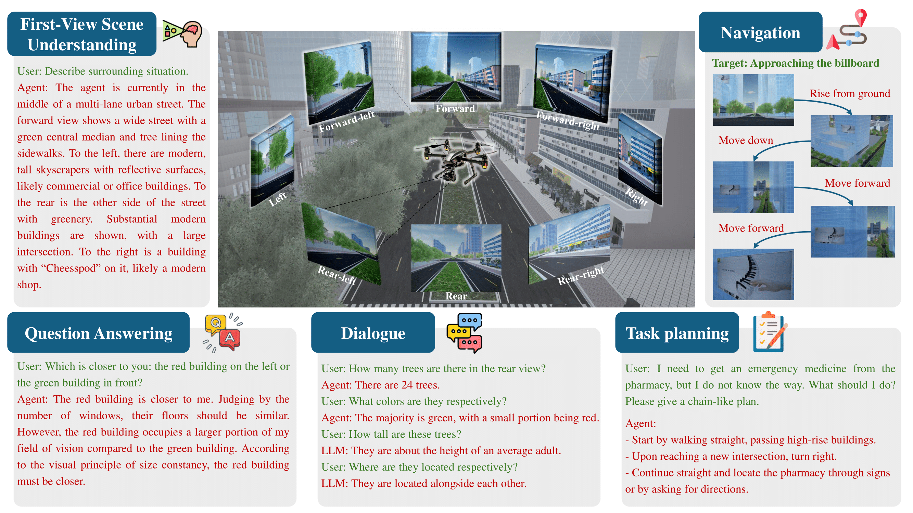

# Embodied City

##  <a name='Introduction'></a> News 🎉

[2024.10.12] We release the full paper on arXiv: [link](https://arxiv.org/abs/2410.09604).

##  1 <a name='Introduction'></a> Introduction 🌟

Embodied intelligence is considered one of the most promising directions for artificial general intelligence, with human-like abilities interacting with the world. However, most works focus on bounded indoor environments, with limited literature on open-world scenarios. To address this, we release a new benchmark platform, named [Embodied City](https://embodied-ai.city), for embodied intelligence in urban environments. This platform includes a simulator and datasets on representative tasks for embodied intelligence in an urban environment. You can either request the API key to access the online deployed environment, or download it to deploy in your own server.




##  2 <a name='Simulator'></a> Simulator 🌆

We construct an environment where the agents🤖 can perceive, reason, and take actions. The basic environment of the simulator includes a large business district in Beijing, one of the biggest city in China, in which we build 3D model for buildings, streets, and other elements, hosted by [Unreal Engine](https://www.unrealengine.com/).
#### 2.1 Buildings 
We first manually use [Blender4](https://www.blender.org/) to create the 3D asserts of the buildings, for which we use the streetview services of [Baidu Map](https://map.baidu.com/) and [Amap](https://amap.com/). The city level detail includes a variety of building types such as office towers🏢, shopping malls🏬, residential complexes🏠, and public facilities🏫. These models are textured and detailed to closely resemble their real-world counterparts to enhance realism in the simulation.
#### 2.2 Streets 
The streets are modeled to include all necessary components such as lanes🛣️, intersections❌, traffic signals🚦, and road markings⬆️. We also incorporate pedestrian pathways, cycling lanes, and parking areas. Data from traffic monitoring systems and mapping services help ensure that the street layout and traffic flow patterns are accurate and realistic.

#### 2.3 Other Elements 

Other elements include street furniture🚸 (benches, streetlights, signs) , vegetation🌳 (trees, shrubs, lawns), and urban amenities🚉 (bus stops, metro-entrances, public restrooms). These are also created using Blender, based on real-world references from the street view services mentioned above. Additionally, dynamic elements like vehicles🚗 and pedestrians🚶 are simulated to move realistically within the environment, contributing to the liveliness and accuracy of the urban simulation. The simulation algorithms of vehicles and pedestrians are based on [Mirage Simulation System](https://dl.acm.org/doi/pdf/10.1145/3557915.3560950).


##  3 <a name='Usage'></a> Online Usage 🔑

We provide a simple Python SDK to interact with the Embodied City API. Users can easily achieve perception and control of drone agents through the following functions. When the command is issued via the API, changes in the agent's first-person view will be observed in the **Console**.

#### 3.1 Acquire ID and token
Before using the SDK, you need to acquire a agent and obtain its token signing up at [Embodied City](https://embodied-ai.city). In the website, you should go to the **Console** page, choose an available drone, and click on the **Acquire** button.

❗️The token is a secret key that should not be shared with anyone.

❗️The token will expire after a certain period of time if you do not use it.

#### 3.2 Installation

```bash
pip install embodiedcity
```

#### 3.3 Initialize the client

```python
from embodiedcity import DroneClient, ImageType, CameraID

base_url = "https://embodied-ai.city"
drone_id = "xxx"
token = "xxxxxxxx"
client = DroneClient(base_url, drone_id, token)
```
#### 3.4 Basic Controls

###### Move the drone
```python
# Move the drone forward by 10 meter (Short movement distance may result in action failure)
client.move_back_forth(10)
```
###### Get the RGB image
```python
# Get a RGB image from the front-center camera
image = client.get_image(ImageType.Scene, CameraID.FrontCenter)
```

###### Get the depth image
```python
# Get an image of the depth from the front-center camera
image = client.get_image(ImageType.DepthPlanar, CameraID.FrontCenter)
```
Here is the detailed [API documentation](./API.py).

#### 3.5 Release the drone
After you finish using the drone, you should release it to make it available for others. You can do this by clicking on the **Release** button in the **Console** page.

#### 3.6 FAQ

##### After invoking the control action, the drone did not move.

It is possible that the drone collided with a building. Try issuing a command to move the drone in a direction without obstacles. Alternatively, use the function DroneClient.move_to_position to force it to a specified location.

##### What should I do if I need the drone to perform more complex operations?

Please download and install the full embodiedcity simulator.

##  4 <a name='Tasks'></a> Embodied Tasks 📋

In the Embodied City, we define five key embodied tasks that reflect three essential human-like abilities for intelligent agents in an open world: perception, reasoning, and decision-making. For perception, we focus on the task of [embodied first-view scene understanding](#431-embodied-first-view-scene-understanding); for reasoning, we address [embodied question answering](#432-embodied-question-answering) and [dialogue](#433-embodied-dialogue); and for decision-making, we include [embodied action (visual-language navigation)](#434-embodied-action-vision-and-language-navigation) and [embodied task planning](#435-embodied-task-planning). 




#### 4.1 Environment

Download and extract the full embodiedcity simulator of offline version. Users can download the offline simulation environment for local deployment to train and test agents. The platform provides versions compatible with Windows, Linux, macOS, and other operating systems, enabling quick deployment and testing.
For download links, please contact: [chgao96@tsinghua.edu.cn](mailto:chgao96@tsinghua.edu.cn)

```bash
conda env create -n EmbodiedCity -f environment.yml
conda activate EmbodiedCity
```

or

```bash
conda create -n EmbodiedCity python=3.10
conda activate EmbodiedCity
pip install -r requirements.txt
```

#### 4.2 Running

##### 4.2.1 Embodied Vision-Language Navigation

We provides an example of a Vision-Language Navigation (VLN) task implementation. 

##### Files and Directories

- **Code**: The main code for the VLN task is located in [embodied_vln.py](./embodied_vln.py).
- **Dataset**: The corresponding dataset files are located in:
  - [Datasets/vln/start_loc.txt](./Datasets/vln/start_loc.txt) - Defines the starting locations and instructions for each VLN task sample.
  - [Datasets/vln/label](./Datasets/vln/label) - Contains the ground truth trajectories.

##### Usage

In `embodied_vln.py`, the `VLN_evaluator` class is defined. You need to provide the dataset path, the model to be evaluated, and the corresponding API key.

###### Set up model and API key:

```python
model = "xxxxx"  # LM models, e.g., "claude-3-haiku-20240307", "gpt-4o"
api_key = "xxxxxxxxx"  # Fill in your API key
```

###### Initialize the VLN evaluator:

```python
vln_eval = VLN_evaluator("dataset/vln", model, api_key)
```

###### Run the evaluation:

```python
vln_eval.evaluation()
```

We support multimodal models from OpenAI and Claude. If you wish to use a custom model, you can modify the `LM_VLN` class in `utils.py`.


The evaluation process will activate the simulator's drone, running through each VLN task sample. The performance of the model will be quantified using the following three metrics:
- **Success Rate (SR)** measures the proportion of navigation episodes where the agent successfully reaches the target location within a specified margin of error
- **SPL (Success weighted by Path Length)** is a metric that considers both the success rate and the efficiency of the path taken by the agent. It accounts for how closely the agent's path length matches the optimal path length.
- **Navigation Error (NE)** measures the average distance from the agent's final location to the target destination.


##### 4.2.2 Other tasks

If you would like to perform the tasks of embodied first-view scene understanding, question answering, dialogue, and task planning, please see the examples in [embodied_tasks.py](./embodied_tasks.py). Corresponding dataset is in [Datasets/Imgs](./Datasets/Imgs) and  [Datasets/Imgs_label](./Datasets/Imgs_label).

In the `embodied_tasks.py` file, you should first define the queries you want to evaluate and place them into the `query_dict` dictionary. Here are examples for different tasks:

- *Embodied First-view Scene Understanding*: `query_dict['scene']`
- *Embodied Question Answering*: `query_dict['qa1']`, `query_dict['qa2']`, `query_dict['qa3']`
- *Embodied Dialogue*: `query_dict['dialog1']`, `query_dict['dialog2']`, `query_dict['dialog3']`
- *Embodied Task Planning*: `query_dict['tp1']`, `query_dict['tp2']`

###### Initialize the model

```python
# You need to specify the model and the corresponding API key. Supported models include multimodal models from OpenAI, Claude, and Qwen.
model = "xxxxx"  # LM models, e.g., "claude-3-haiku-20240307", "gpt-4o"
api_key = "xxxxxxxxx"  # Fill in API key
```

###### Initialize the *EmbodiedTasks* Class:

```python
embodied_tasks = EmbodiedTasks(query_dict, model, api_key)
```

###### Run the tasks

```python
# The results of the model's performance will be saved in the `./results/` folder, named as `task_type_model_name.csv`.
embodied_tasks.run()
```

###### Evaluate the model

```python
# You can evaluate the model's performance using
embodied_tasks.evaluate()
```

This will provide quantitative metrics including *BLEU-1, BLEU-2, BLEU-3, BLEU-4, ROUGE, METEOR,* and *CIDEr*.

Besides, RGB observations are stored offline in the `./Datasets/Imgs` folder for convenience. Labels for different tasks are stored in `./Datasets/Imgs_label`.


#### 4.3 Task Definition

##### 4.3.1 Embodied First-view Scene Understanding

The first-view scene understanding requires the agent able to well observe the environment, and give the accurate description, which could considered as a basic ability for the further tasks. We observe from different perspectives at the same location, generating a set of RGB  images as the **input** of scene understanding. The **output** is the textual description for the given scene images.

##### 4.3.2 Embodied Question Answering

With the first-view observation, the embodied agent could be further fed with a query posed in natural language about the environment. The **input** includes both the first-view RGB images and a query about the environment. The **output** should be the direct textual responses to the question. Here we provide three questions:

* How many traffic lights can be observed around in total?
* Is there a building on the left side? What color is it?
* Are you facing the road, the building, or the greenery?

##### 4.3.3 Embodied Dialogue

Embodied dialogue involves ongoing interactions where the agent engages in a back-and-forth conversation with the user。 This requires maintaining context and understanding the flow of dialogue. Therefore, the **input** includes embodied observations and multi-round queries, and the **output** is the multi-round responses. Here we provide three dialogues:

* May I ask if there are any prominent waypoints around? **->** Where are they located respectively?
* May I ask what color the building on the left is? **->** Where is it located relative to the road ahead?
* How many trees are there in the rear view? **->** What colors are they respectively?

##### 4.3.4 Embodied Action (Vision-and-Language Navigation)

Embodied Action, often referred to as Vision-and-Language Navigation (VLN), is a research area in artificial intelligence that focuses on enabling an agent to navigate an environment based on natural language instructions. The **input** combines visual perception and natural language instructions to guide the agent through complex environments. The **output** is the action sequences following the language instructions.

##### 4.3.5 Embodied Task Planning
The decision-making in the real world does not have explicit instructions; otherwise, there is only a task goal. It is significant for the embodied agents to be able to compose the complex and long-term task goals into several sub-tasks, which we refer to as embodied task planning. The **input** is the first-view observations and a given natural language described task goal, and the **output** should be a series of sub-tasks that the agent plans to execute. Here we provide three tasks:

* I want to have a cup of coffee at ALL-Star coffee shop, but I have not brought any money. What should I do? Please give a chain-like plan.
* I need to get an emergency medicine from the pharmacy, but I do not know the way. What should I do? Please give a chain-like plan.
* I lost my wallet nearby, and now I need to find it. What should I do? Please give a chain-like plan.


##  5 <a name='Citation'></a> Citation 📝

Please cite our paper if you find EmbodiedCity helpful in your research.

```
@article{gao2024embodied,
  title={EmbodiedCity: A Benchmark Platform for Embodied Agent in Real-world City Environment},
  author={Gao, Chen and Zhao, Baining and Zhang, Weichen and Zhang, Jun and Mao, Jinzhu and Zheng, Zhiheng and Man, Fanhang and Fang, Jianjie and Zhou, Zile and Cui, Jinqiang and Chen, Xinlei and Li, Yong},
  journal={arXiv preprint},
  year={2024}
}
```
